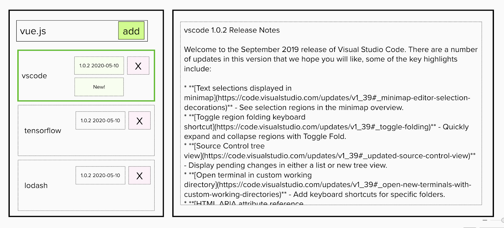

# Lumanu “Onsite” Home Coding Exercise

## Problem statement

All of us use a wide variety of open source libraries and projects, but oftentimes it can be hard to keep up with new releases. We want to build a simple tool using the [GitHub API](https://docs.github.com/en/rest/reference/repos) that allows us to keep track of the most recent date/version associated with various repos.

The output should be a web app client. No backend server is required; you can use LocalStorage (or IndexedDB) or any other libraries for storing data.

You can clone [our starter kit (TypeScript / React)](https://github.com/lumanu/gh-release-monitor) at or create your own project from scratch using any language / framework / libraries you desire.

Submit your project by sending a link to your repo (or a gzip/zip file containing your entire project) with instructions on how to run it to [engineering@lumanu.com](mailto:engineering@lumanu.com).

## This exercise is intended to
**1. Make a basic assessment of your ability to build modern web apps**
- *Take as much time as you need, but don't feel like you need to spend more than a few hours*
- *Pull in any third party libraries you might need*
- Look up any documentation that you need
- If you have time, try to tackle one or more of the extended user stories, but they are optional

**2. Be somewhat close to a real workflow that you would encounter working at Lumanu (or any other startup)**
- The exercise is intentionally open ended
- Try to address all the MVP (minimal viable product) user stories, but if you get stuck, it’s ok to submit a partially working prototype that only addresses some of them
- Ask for help if you need clarification or hints if you get stuck

**3. Allow you an opportunity to showcase your personal flair and skills beyond the basics**
- Everything in the spec beyond the MVP user stories (including UI) can be customized by you
- Use our initial starter kit or don't
- Feel free to be creative in addressing the user stories

## MVP user stories
1. Users can add GitHub repos they want to keep track of. App keeps track of added repos (e.g. using LocalStorage/IndexedDB) until application data is cleared.   No need for a formal user or authentication concept at this point.
2. Users can see the last release date associated with each repo.
3. Users can mark a release as seen (for example, this can be done in the sample UI below by opening the details view associated with each repo)
4. There is a visual indicator for repositories with new releases since they were last marked as seen.
5. There is a way to reload release data for all repos (e.g. by refreshing the app)

## Example UI
Here is one example wireframe sketch of a (probably poor) UI.  Feel free to be creative and come up with your own UI.

## Some optional things to consider beyond MVP user stories if you have time

1. Release notes / other data that we might want to present in a details view.
2. Should this app work on mobile web?
3. When to load/update data and what loading states should be there.
4. Filter (or sort) repo list so as to easily see repos with new releases since we've last seen them
5. Other ways to categorize / search / filter repositories
6. Additional personal metadata associated with each repo.   E.g. the ability to mark a release as something to revisit / to updates in other projects.
7. Some projects don't use GitHub releases.   Maybe we can use commit activity as a second data point?
8. Desktop / mobile notifications
9. How would you build a real server for this / turn this into a service that would store data beyond the local browser?

## Resources
These resources may (or may not) be useful:

- [Octokit libraries for working with the GiHub API](https://developer.github.com/v3/libraries/)
- [GitHub releases API](https://docs.github.com/en/free-pro-team@latest/graphql/reference/objects#release)
- [GitHub search API](https://docs.github.com/en/rest/reference/search)
- [LocalStorage (MDN documentation)](https://developer.mozilla.org/en-US/docs/Web/API/Window/localStorage)
- [IndexedDB (MDN documentation)](https://developer.mozilla.org/en-US/docs/Web/API/IndexedDB_API)
